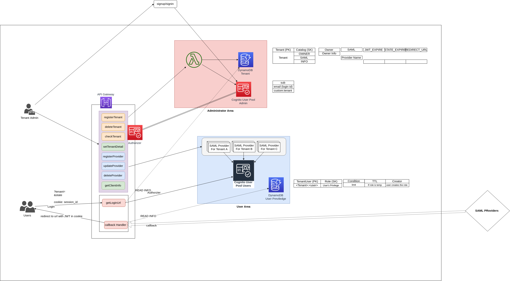

# office-maker-accounts


## System Require
[Node.js](https://nodejs.org/) (>= 10)  
[Serverless Frameworks](https://serverless.com/framework/)  
[npm](https://www.npmjs.com/)  

### Require when Test
[jq](https://stedolan.github.io/jq/) Build-in for Most Linux

[yq](https://mikefarah.github.io/yq/)

## Installing

 ```npm install```

## Resource Created on AWS
- 2 DynamoDB Table
- 2 Cognito User Pool with 1 Client Each
- 1 API Gateway
- Lambdas
- Related Policies and Roles


## Create APIs
- POST admin/tenants?tenant=<tenant>
> create tenant

- DELETE admin/tenants/<tenant>
> delete all related information of tenant <tenant>

- HEAD admin/tenants/<tenant>
> check if tenant is available to use

- GET admin/tenants
> get all owned tenants name for current user

- GET admin/client-info
> get information needed to set saml

- POST admin/providers?tenant=<tenant> 
body { 
  metadata: xml | metadataUrl: url ,
  attributeMap: {attributeInCognito: attribute in your saml}
}
> create provider info

- POST admin/providers/<tenant>
body { 
  metadata: xml | metadataUrl: url ,
  attributeMap: {attributeInCognito: attribute in your saml}
}
> update provider info

- DELETE admin/providers/<tenant>
> delete saml provider

- GET admin/providers/<tenant>
> get saml provider information

- POST admin/tenants/<tenant>/info/options
body{
  enableLoginFree: string | boolean
  loginFreeIPs: string[] | undefined
  enableLoginRestrict: string | boolean
  loginRestrictIPs: string[] | undefined
  bufferTime: string
}
> set optional information

- POST admin/tenants/<tenant_name>/info/required
body{
  jwtExpireTime?: string | undefined
  stateExpireTime?: string | undefined
  redirectUrl?: string | undefined
}
> set required tenant information

- GET admin/tenants/<tenant_name>/info
> get tenant extra information

## Description of Files
- babel.config.js
Used for smoke test, test content is in folder `./test-flow/`

- config.sample.yaml
Sample file of config file, need to create a copy named `config.yaml` and then fill the parameters

- package.json
For npm or yarn

- tsconfig.json
Config file for `typescript`. Used when coding, test and packaging

- webpack.config.js
Used when serverless package and deploy

- cloudformation/cf_for_serverless.yaml
CloudFormation File used for Serverless.

- script/post-deploy.sh
Bash script need to run after deploy, to add additional setting not supported by CloudFormation

- script/test.sh
Bash script used for test. Fetch environment parameters before test.

- src/
Source file folder

- test/
Unit test folder

- test-flow/
Smoke test

## Name Explanation
Administrator: user of worksmap, who integrate worksmap with his own company

User Manager: member of one tenant, able to set permission of all users in his own tenant
Floor Manager: member of one tenant, able to modify floor of his tenant
Worksmap Manager: both user manager and floor manager
Normal User: member of one tenant, able to read public map

Worksmap DevOps: Developers and operators who maintain Worksmap service

 
## Provided Functions
### For Logged In Administrator
- add unique name tenant
- delete, get tenant belongs to him

- add, update, get, delete saml Provider for his tenant
- set (add, update) jwt expire length
- set (add, update) login expire length: the time a user must finish saml login within
- set (add, update) redirect url: default redirect url, could be override with query parameter `state=` passed when initial the login 

- jwt expire time, login expire time, and redirect url cannot be delete directly (delete when tenant is deleted)

- choose to enable [login free](#login-free) function or not
- choose to enable [login restrict](#login-restrict) function or not
- (todo) enable super restrict mode, only able to access within given IP, mobile network will not be able to use
 
- (todo) add, update, delete worksmap manager for the tenant
- (todo) connect to the tenant's database to get employees detail information, and provide a mapping

### Login Free
Login free is a function allows tenant user to READ the map without login as long as the user's IP address is contained in an IP list the administrator set

While setting, if Login Free is enabled, the corresponding ip string must be provided. This string is comma separated ip, e.g. (1.1.1.1,3.3.3.3)

### Login Restrict
Login Restrict is a function that only allow tenant user to login himself when his IP address is contained in an IP list the administrator set

There is an extra option `bufferTime` that additional allow user to login even if his IP address is not in given IP as long as he has logged in within `bufferTime`.

Notice, for login restrict function, if a user is logged in, he could access worksmap in maximum time: bufferTime + jwtExpiredTime

e.g.:

If you want user to be unable to access to worksmap as long as he is delete from organization unit, you should use a small jwtExpiredTime like 60 seconds.

But you also want to allow user to be able to use worksmap with IP restriction, along with as long as his was logged in in 15 minutes, then the bufferTime should be set to 840 seconds.

Or simply set jwtExpiredTime to 5 minutes (300 seconds) and bufferTime to 0.


  


### For SAML Login
- redirect to responding SAML idp
- response to saml callback

## Restriction
- Administrator could not own more than 1 tenant

## Limitaion


## Configuration and Presequence
- Prepare a custom domain for API Gateway.

- Store the public key and private key on Systems Manager > Parameter Store

- Create config.yaml
```cp config.sample.yaml config.yaml```
  - COGNITO
    Enter Unique Preferred Cognito Custom domain
  - API_BASE_URL
    default domain for office-maker api.
    e.g., `api.example.com`
  - WWW_BASE_URL
    Use to set the default callback url, and CORS. Will auto replace        `<tenant>` with the corresponding tenant
     
    template url, if base url for domain `xxx` is `www.example.com/xxx`,
    this url is `www.example.com/<tenant>`.
    
    You could use `<tenant>.example.com` if you prefers this style.
    
  - SSM
    Enter the public key name and private key encrypted stored in ssm. Replace `key_name_to_use` to your key name.
    
  - SYSTEM
    Parameters when generate system token.

## Deployment
```sls deploy -s <stage name>```
```bash ./script/post-deploy.sh```

## Removement
```sls remove -s <stage name>```

## Authors

TODO

## Copyright

© 2017-Present WorksApplications CO.,LTD.

## License

[Apache License 2.0](LICENSE)
